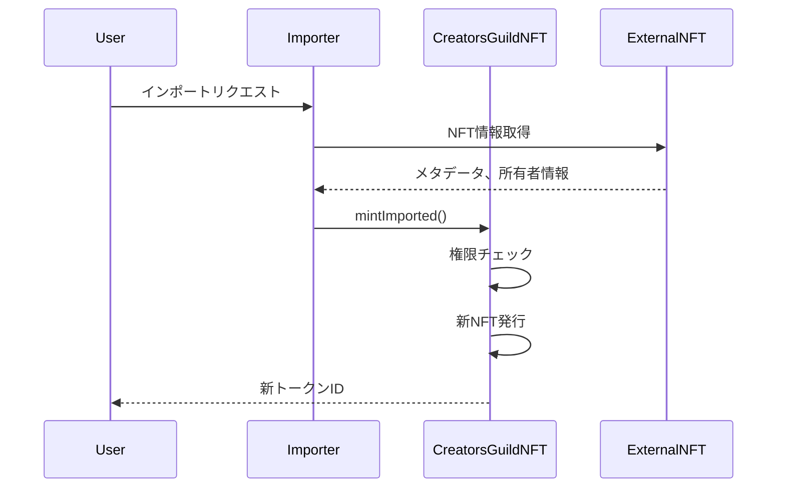

# CreatorsGuild NFT インポートシステム仕様書

## 1. 概要

### 1.1 目的
CreatorsGuild NFTインポートシステムは、他のプラットフォームやブロックチェーンから既存のNFTを移行し、CreatorsGuildエコシステムの機能（寄付、TBA、ロイヤリティ等）を追加できるようにする仕組みです。

### 1.2 設計思想
- **相互運用性**: 既存のNFTエコシステムとの共存
- **履歴保持**: オリジナルNFTの情報を永続的に保存
- **クリエイター尊重**: 元のクリエイター情報を維持
- **柔軟性**: 様々なプラットフォームからのインポートに対応

### 1.3 システムアーキテクチャ
```
[外部NFT] → [インポーター] → [CreatorsGuildNFT]
                ↓
          [権限チェック]
                ↓
          [データ変換]
                ↓
          [新NFT発行]
```

---

## 2. コンポーネント

### 2.1 インポーター管理

#### setImporter
```solidity
function setImporter(address importer, bool status) external
```

**役割**: インポート権限を持つアドレスを管理

**権限**: オーナーのみ実行可能

**イベント**:
```solidity
event ImporterSet(address indexed importer, bool status);
```

#### isImporter
```solidity
function isImporter(address account) external view returns (bool)
```

**役割**: アドレスがインポーター権限を持つか確認

### 2.2 インポート実行

#### mintImported
```solidity
function mintImported(
    address to,
    string memory _metaUrl,
    uint16 _feeRate,
    bool _sbtFlag,
    address creator,
    string memory originalInfo
) external returns (uint256)
```

**役割**: 外部NFTをCreatorsGuildNFTとして再発行

**権限**: オーナーまたは承認されたインポーター

**特徴**:
- 新しいトークンIDを自動採番
- オリジナル情報を保持
- 元のクリエイターを記録

---

## 3. インポートワークフロー

### 3.1 基本フロー



### 3.2 バッチインポートフロー

```solidity
contract BatchImporter {
    CreatorsGuildNFT public targetContract;
    
    struct ImportData {
        address to;
        string metaUrl;
        uint16 feeRate;
        bool sbtFlag;
        address creator;
        string originalInfo;
    }
    
    function batchImport(ImportData[] calldata imports) external {
        for (uint i = 0; i < imports.length; i++) {
            targetContract.mintImported(
                imports[i].to,
                imports[i].metaUrl,
                imports[i].feeRate,
                imports[i].sbtFlag,
                imports[i].creator,
                imports[i].originalInfo
            );
        }
    }
}
```

---

## 4. originalInfo フォーマット仕様

### 4.1 推奨JSON形式

```json
{
    "source": {
        "platform": "OpenSea",
        "chain": "Ethereum",
        "chainId": 1,
        "contract": "0x1234567890123456789012345678901234567890",
        "tokenId": "12345",
        "standard": "ERC721"
    },
    "import": {
        "timestamp": 1704067200,
        "txHash": "0xabcdef...",
        "importer": "0x9876543210987654321098765432109876543210"
    },
    "metadata": {
        "originalUri": "ipfs://QmOriginal...",
        "attributes": {}
    }
}
```

### 4.2 簡易文字列形式

```
Platform:Contract:TokenId:ChainId
```

例:
```
OpenSea:0x1234...5678:12345:1
Rarible:0xabcd...ef01:67890:137
```

### 4.3 カスタムフォーマット

各プロジェクトのニーズに応じて独自フォーマットも可能：
```solidity
// ゲームNFTの例
"GameID:123|CharacterID:456|Level:50|ImportDate:2024-01-01"

// アートNFTの例  
"Artist:0x123...|Collection:Genesis|Edition:1/100|Year:2023"
```

---

## 5. 実装例

### 5.1 シンプルなインポーター

```solidity
contract SimpleImporter {
    CreatorsGuildNFT public immutable creatorsGuild;
    address public owner;
    
    constructor(address _creatorsGuild) {
        creatorsGuild = CreatorsGuildNFT(_creatorsGuild);
        owner = msg.sender;
    }
    
    function importNFT(
        address to,
        string memory metaUrl,
        uint16 royaltyRate,
        address originalCreator,
        string memory platform,
        address originalContract,
        uint256 originalTokenId
    ) external {
        require(msg.sender == owner, "Only owner");
        
        // originalInfo を構築
        string memory originalInfo = string(abi.encodePacked(
            platform, ":",
            Strings.toHexString(originalContract), ":",
            Strings.toString(originalTokenId), ":",
            Strings.toString(block.chainid)
        ));
        
        // インポート実行
        creatorsGuild.mintImported(
            to,
            metaUrl,
            royaltyRate,
            false, // SBTではない
            originalCreator,
            originalInfo
        );
    }
}
```

### 5.2 ブリッジインポーター

```solidity
contract BridgeImporter {
    CreatorsGuildNFT public immutable creatorsGuild;
    mapping(bytes32 => bool) public processedImports;
    
    event ImportProcessed(
        bytes32 indexed importId,
        uint256 newTokenId,
        address indexed originalContract,
        uint256 originalTokenId
    );
    
    function importFromBridge(
        address to,
        string memory metaUrl,
        uint16 royaltyRate,
        address creator,
        uint256 sourceChainId,
        address sourceContract,
        uint256 sourceTokenId,
        bytes memory proof
    ) external {
        // 重複インポート防止
        bytes32 importId = keccak256(abi.encode(
            sourceChainId,
            sourceContract,
            sourceTokenId
        ));
        require(!processedImports[importId], "Already imported");
        
        // ブリッジ証明の検証（実装は省略）
        require(verifyBridgeProof(proof), "Invalid proof");
        
        // originalInfo構築
        string memory originalInfo = string(abi.encodePacked(
            '{"chain":', Strings.toString(sourceChainId),
            ',"contract":"', Strings.toHexString(sourceContract),
            '","tokenId":', Strings.toString(sourceTokenId),
            ',"bridgeTime":', Strings.toString(block.timestamp),
            '}'
        ));
        
        // インポート実行
        uint256 newTokenId = creatorsGuild.mintImported(
            to,
            metaUrl,
            royaltyRate,
            false,
            creator,
            originalInfo
        );
        
        processedImports[importId] = true;
        emit ImportProcessed(importId, newTokenId, sourceContract, sourceTokenId);
    }
}
```

### 5.3 マーケットプレイス移行インポーター

```solidity
contract MarketplaceMigrator {
    CreatorsGuildNFT public immutable creatorsGuild;
    IERC721 public immutable oldCollection;
    
    mapping(uint256 => uint256) public tokenIdMapping; // old -> new
    
    function migrateToken(uint256 oldTokenId) external {
        // 所有者確認
        address tokenOwner = oldCollection.ownerOf(oldTokenId);
        require(msg.sender == tokenOwner, "Not token owner");
        
        // メタデータ取得
        string memory metaUrl = oldCollection.tokenURI(oldTokenId);
        
        // オリジナル情報
        string memory originalInfo = string(abi.encodePacked(
            '{"migrated":true,',
            '"oldContract":"', Strings.toHexString(address(oldCollection)), '",',
            '"oldTokenId":', Strings.toString(oldTokenId), ',',
            '"migrationDate":', Strings.toString(block.timestamp), '}'
        ));
        
        // 新トークン発行
        uint256 newTokenId = creatorsGuild.mintImported(
            tokenOwner,
            metaUrl,
            250, // 2.5% royalty
            false,
            tokenOwner, // 元の所有者をクリエイターとして記録
            originalInfo
        );
        
        tokenIdMapping[oldTokenId] = newTokenId;
        
        // オプション: 古いNFTをバーン or ロック
        oldCollection.transferFrom(tokenOwner, address(this), oldTokenId);
    }
}
```

---

## 6. セキュリティガイドライン

### 6.1 インポーター管理

**ベストプラクティス**:
1. **最小権限の原則**: 必要最小限のアドレスにのみ権限付与
2. **定期的な監査**: インポーターリストの定期的な見直し
3. **マルチシグ推奨**: 重要なインポーターはマルチシグウォレット
4. **タイムロック**: 権限付与/剥奪にタイムロックを検討

**実装例**:
```solidity
contract TimelockImporterManager {
    uint256 public constant TIMELOCK = 2 days;
    
    struct ImporterRequest {
        address importer;
        bool status;
        uint256 executeTime;
    }
    
    mapping(uint256 => ImporterRequest) public requests;
    uint256 public requestCount;
    
    function requestSetImporter(address importer, bool status) external onlyOwner {
        requests[requestCount] = ImporterRequest({
            importer: importer,
            status: status,
            executeTime: block.timestamp + TIMELOCK
        });
        requestCount++;
    }
    
    function executeSetImporter(uint256 requestId) external {
        ImporterRequest memory request = requests[requestId];
        require(block.timestamp >= request.executeTime, "Timelock active");
        creatorsGuild.setImporter(request.importer, request.status);
        delete requests[requestId];
    }
}
```

### 6.2 インポートデータ検証

**チェックリスト**:
- [ ] メタデータURLの有効性確認
- [ ] ロイヤリティ率の妥当性（0-10%推奨）
- [ ] クリエイターアドレスの検証
- [ ] 重複インポートの防止
- [ ] originalInfoのサイズ制限

**検証実装例**:
```solidity
function validateImportData(
    string memory metaUrl,
    uint16 feeRate,
    address creator
) internal pure {
    require(bytes(metaUrl).length > 0, "Empty metadata URL");
    require(bytes(metaUrl).length < 500, "Metadata URL too long");
    require(feeRate <= 1000, "Royalty too high"); // max 10%
    require(creator != address(0), "Invalid creator");
}
```

### 6.3 悪意のあるインポート対策

**リスク要因**:
1. **偽造NFT**: 他人のNFTを無断でインポート
2. **メタデータ汚染**: 悪意のあるメタデータURL
3. **DoS攻撃**: 大量の無効なインポートリクエスト

**対策**:
```solidity
contract SecureImporter {
    mapping(address => uint256) public lastImportTime;
    uint256 public constant IMPORT_COOLDOWN = 1 minutes;
    uint256 public constant MAX_BATCH_SIZE = 50;
    
    modifier rateLimited() {
        require(
            block.timestamp >= lastImportTime[msg.sender] + IMPORT_COOLDOWN,
            "Rate limit exceeded"
        );
        lastImportTime[msg.sender] = block.timestamp;
        _;
    }
    
    function secureImport(...) external rateLimited {
        // インポート処理
    }
}
```

---

## 7. フロントエンド統合

### 7.1 インポートUI実装例

```typescript
interface ImportFormData {
    platform: string;
    contractAddress: string;
    tokenId: string;
    proof?: string;
}

async function importNFT(data: ImportFormData) {
    try {
        // 1. 元のNFT情報を取得
        const originalNFT = await fetchOriginalNFT(
            data.platform,
            data.contractAddress,
            data.tokenId
        );
        
        // 2. メタデータを取得/変換
        const metadata = await convertMetadata(originalNFT.metadataUri);
        
        // 3. originalInfo を構築
        const originalInfo = JSON.stringify({
            source: {
                platform: data.platform,
                contract: data.contractAddress,
                tokenId: data.tokenId,
                chain: await getChainName()
            },
            import: {
                timestamp: Date.now(),
                userAgent: navigator.userAgent
            }
        });
        
        // 4. インポート実行
        const tx = await importerContract.mintImported(
            userAddress,
            metadata.uri,
            metadata.royaltyRate || 250, // デフォルト2.5%
            originalNFT.creator,
            originalInfo
        );
        
        // 5. トランザクション確認
        const receipt = await tx.wait();
        const tokenId = extractTokenId(receipt);
        
        return {
            success: true,
            tokenId,
            transactionHash: receipt.transactionHash
        };
    } catch (error) {
        console.error('Import failed:', error);
        throw error;
    }
}
```

### 7.2 インポート状態管理

```typescript
enum ImportStatus {
    IDLE = 'idle',
    FETCHING = 'fetching',
    CONFIRMING = 'confirming',
    IMPORTING = 'importing',
    SUCCESS = 'success',
    ERROR = 'error'
}

interface ImportState {
    status: ImportStatus;
    progress: number;
    message: string;
    result?: {
        tokenId: string;
        txHash: string;
    };
    error?: Error;
}

// React Hook例
function useNFTImport() {
    const [state, setState] = useState<ImportState>({
        status: ImportStatus.IDLE,
        progress: 0,
        message: ''
    });
    
    const importNFT = useCallback(async (data: ImportFormData) => {
        setState({ status: ImportStatus.FETCHING, progress: 20, message: 'Fetching NFT data...' });
        
        try {
            // インポート処理
            const result = await performImport(data);
            setState({
                status: ImportStatus.SUCCESS,
                progress: 100,
                message: 'Import successful!',
                result
            });
        } catch (error) {
            setState({
                status: ImportStatus.ERROR,
                progress: 0,
                message: 'Import failed',
                error: error as Error
            });
        }
    }, []);
    
    return { state, importNFT };
}
```

---

## 8. トラブルシューティング

### 8.1 よくある問題と解決策

| 問題 | 原因 | 解決策 |
|------|------|--------|
| "Not authorized" エラー | インポーター権限がない | オーナーに権限付与を依頼 |
| "Invalid metadata" | メタデータURLが無効 | URLフォーマットを確認 |
| ガス代が高い | 大量のデータ処理 | バッチ処理やオフチェーン処理を検討 |
| 重複インポート | 同じNFTを複数回インポート | インポート履歴の確認機能を実装 |

### 8.2 デバッグ手順

1. **権限確認**
```javascript
const hasPermission = await contract.isImporter(importerAddress);
console.log('Importer permission:', hasPermission);
```

2. **インポート履歴確認**
```javascript
const originalInfo = await contract.getOriginalTokenInfo(tokenId);
console.log('Original info:', JSON.parse(originalInfo));
```

3. **イベントログ確認**
```javascript
const filter = contract.filters.ImporterSet();
const events = await contract.queryFilter(filter);
events.forEach(event => {
    console.log('Importer set:', event.args);
});
```

---

## 9. 今後の拡張案

### 9.1 自動検証システム
```solidity
interface IOriginalNFTVerifier {
    function verifyOwnership(
        address contract,
        uint256 tokenId,
        address claimer
    ) external returns (bool);
}
```

### 9.2 メタデータ自動変換
```solidity
interface IMetadataConverter {
    function convertMetadata(
        string memory originalUri,
        string memory platform
    ) external returns (string memory newUri);
}
```

### 9.3 クロスチェーンインポート
```solidity
interface ICrossChainImporter {
    function importFromChain(
        uint256 sourceChain,
        bytes memory proof,
        ImportData memory data
    ) external;
}
```

---

## 10. まとめ

CreatorsGuildのインポートシステムは、既存のNFTエコシステムとの橋渡しを実現し、クリエイターと所有者の両方に新しい価値を提供します。適切なセキュリティ対策と実装により、安全で効率的なNFT移行が可能になります。